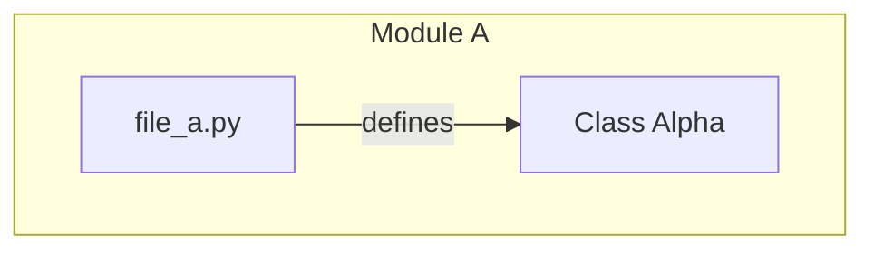
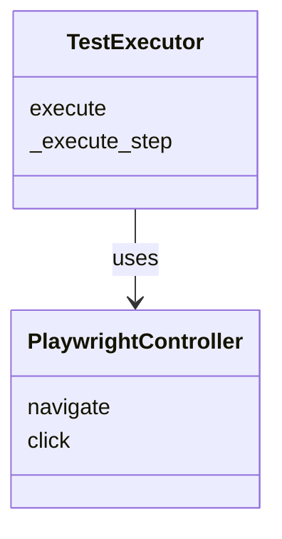

# Codebase Knowledge Graph Generation Prompt (v2 - Fallback)

## Role
You are an Expert Software Architect and Data Visualization Specialist. Your goal is to analyze a codebase and generate a structured, visual knowledge graph that reveals the system's architecture, dependencies, and logical flow.

## Input
You will be provided with a file named `repomix-output.xml` which contains the entire codebase.

## CRITICAL CONSTRAINTS (READ CAREFULLY)
1.  **DO NOT READ INDIVIDUAL FILES.** The `repomix-output.xml` file contains **ALL** the source code you need.
2.  **DO NOT traverse directories.** You already have the full context in the XML dump.
3.  **Analyze ONLY the provided XML.** Reading individual files is a waste of tools and time.

## Analysis Instructions
1.  **Scan & Inventory**:
    *   Identify all source code files (Python, JS, etc.).
    *   Identify key entities within files: Classes, Functions, Global Variables.
    *   Identify configuration files (`setup.py`, `package.json`, etc.).

2.  **Relationship Mapping**:
    *   **Imports/Dependencies**: Who imports whom?
    *   **Inheritance**: Class hierarchy (`class Child(Parent)`).
    *   **Instantiation/Calls**: Who creates instances of whom? Who calls whom?
    *   **Data Flow**: Where does data enter and leave the system?

3.  **Logical Grouping**:
    *   Group files into subgraphs based on directories or logical modules (e.g., `Auth`, `Database`, `UI`).

## Output Requirements

### 1. Dependency Graph (`knowledge_graph.mmd`)
Generate a Mermaid JS graph using `graph TD`.
*   **Focus**: High-level architecture, file dependencies, and class relationships.
*   **Nodes**: Files (yellow), Classes (purple), Functions (blue).
*   **Edges**: "imports", "defines", "uses".

### 2. Class Diagram (`class_diagram.mmd`)
Generate a Mermaid JS `classDiagram`.
*   **Focus**: Detailed class structure.
*   **Content**:
    *   Define classes with their key methods and attributes.
    *   **NUCLEAR SYNTAX RULES (To prevent errors)**:
        1.  **NO Parentheses**: `methodName` NOT `methodName()`
        2.  **NO Visibility Modifiers**: `methodName` NOT `+methodName`
        3.  **NO Return Types**: `methodName` NOT `methodName: Type`
        4.  **NO Dashed Lines**: Use `-->` for ALL relationships.
    *   **Correct Format**:
        ```mermaid
        class Example {
            attributeName
            methodName
        }
        Example --> OtherClass
        ```
    *   Group classes by package/namespace if possible.

### 3. Analysis Report (HTML Snippet)
Generate a brief HTML snippet (div with id `analysis-report`) containing:
*   **Summary**: High-level architectural overview.
*   **Orphans**: List of files with no incoming or outgoing connections.
*   **Refactoring Opportunities**: Circular dependencies, god classes, or tight coupling.

### 4. HTML Template Requirements (CRITICAL)
When generating the final HTML, you MUST use the following JavaScript logic to handle Mermaid rendering in tabs. Mermaid fails if it tries to render a hidden element (`display: none`).
*   **Set `startOnLoad: false`** in `mermaid.initialize`.
*   **Use `mermaid.run()`** manually when a tab is clicked and becomes visible.

**Required Script Pattern:**
```javascript
<script type="module">
    import mermaid from 'https://cdn.jsdelivr.net/npm/mermaid@10/dist/mermaid.esm.min.mjs';
    mermaid.initialize({ startOnLoad: false }); // IMPORTANT: Disable auto-load

    async function renderMermaid(elementId) {
        const element = document.querySelector(`#${elementId} .mermaid`);
        if (element && !element.getAttribute('data-processed')) {
            await mermaid.run({ nodes: [element] });
        }
    }

    window.openTab = async function(evt, tabName) {
        // ... (standard tab switching logic) ...
        document.getElementById(tabName).style.display = "block";
        await renderMermaid(tabName); // Trigger render AFTER making visible
    }

    document.addEventListener('DOMContentLoaded', () => {
        renderMermaid('dependency-graph'); // Render default tab
    });
</script>
```

## Example Output Format




